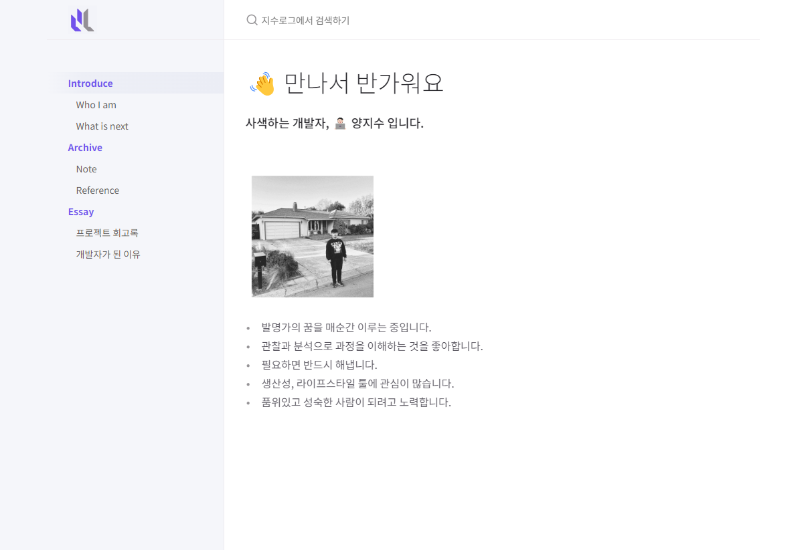

# JISULOG: 지수로그

[바로가기](https://jisulog.com/)

## 🌟 프로젝트 소개

이 블로그는 개발자로서의 저의 경험과 목표를 한데 모아놓은 공간입니다. 여기서는 개인적인 개발 경험과 학습 과정을 통해 얻은 지식을 공유하고자 합니다. 주요 내용으로는 저의 소개 및 목표, 기술 주제 학습 및 시리즈 포스팅, 프로젝트 회고록, 개발자 에세이 등이 있습니다.

## 💻 기술 스택

- **웹 호스팅 서비스**: GitHub Pages
- **사이트 생성 도구**: Jekyll
- **프로그래밍 언어 및 마크업**: HTML/CSS, JavaScript, Ruby, Markdown, Liquid
- **개발 환경(IDE)**: VSCode
- **자동화 도구**: GitHub Actions

## 🎨 테마 및 디자인

Jekyll을 기반으로 하고 있으며, 명료하고 구조적인 문서 제작에 최적화된 [Just the Docs](https://just-the-docs.com/) 테마를 사용합니다. 사용자 인터페이스를 향상시키기 위해 가독성과 시각적 매력을 고려하여 디자인 요소와 레이아웃을 맞춤 제작하고 적용하였습니다.

## ⚙️ 커스텀 기능

- **카테고리**
  - 2단 카테고리 기능
  - 전체 카테고리 항상 표시 기능

- **사이드바**
  - 카테고리 목차(TOC) 대체 기능
  - 목차(TOC) 앵커 링크
  - 이전글/다음글 네비게이션

- **프로젝트 회고 레이아웃**
  - 서비스 개요 자동 구현 기능
  - 이미지 슬라이더 기능
  - 코드 블럭 및 이미지 블럭 가독성 개선

- **아카이브 레이아웃**
  - 자동 탐색 목차 구현 기능

- **페이지**
  - 토글 블럭 기능

- **기타**
  - 로고, 파비콘, 웹폰트
  - CDN을 통한 이미지 로딩속도 개선
  - 한국어 검색 기능

## 📄 저작권
Copyright © 2023. [JISU YANG](mailto:"jisu@ego.so"). All rights reserved.